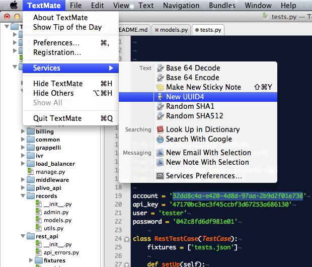
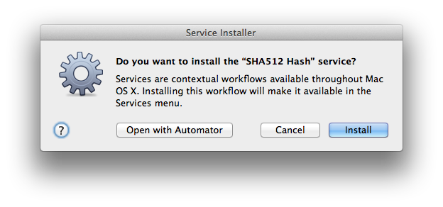

Automator Workflows
-------------------

These are some useful [OS X Automator](http://en.wikipedia.org/wiki/Automator_(software)) services than can be used within all OS X applications to avoid dropping into the shell or going to websites to perform some simple actions like, `base64encode`.

# Usage

Use them in whatever application you want by clicking the name of the application next to the Apple menu button, then click Services and pick the service below that you want.

# Installation

Just [download](archive/master.zip) this repository, unzip it, open up the Services folder, and double click the service you want to install. You'll get a prompt to open it or install it. Click the install button.

# List of Actions

### Clear All Terminal Tabs

Clears all the text in all tabs of the currently activated window in Terminal.app. Great for tailing logs on multiple servers or files.

### Base 64 Encode/Decode

[Base64](http://en.wikipedia.org/wiki/Base64) encode or decode the currently selected text, replacing it.

`Lorem ipsum` <-> `TG9yZW0gaXBzdW0=`

### New UUID4

Insert a new [UUID version 4](http://en.wikipedia.org/wiki/Universally_unique_identifier#Version_4_.28random.29) 36 character globally unique random token (including dashes).

Example: `94dd0765-b883-4828-97ba-94cf90bd166f`

### SHA1

Hash currently selected text, resulting in a 40 character string. Replaces selected text. If no text is selected, a random hash will be inserted.

Example: `54f4e894d78c9e7ef0b05b37e87e5ae819967383`

### SHA512

Hash currently selected text, resulting in a 128 character string. Replaces selected text. If no text is selected, a random hash will be inserted.

Example: `fe89dfa52d7d3f53804139d0741f64d0b5dbb55da7972d9583b009fa594331bf84a37d450d405e809a5111cf01c658e54aaf56b7689bbbe73f3fe6b3fe21b9d0`

## Lorem Ipsum

Inserts [Lorem Ipsum](http://en.wikipedia.org/wiki/Lorem_ipsum) dummy text into current text editing.

    Lorem ipsum dolor sit amet, consectetur adipisicing elit, sed do eiusmod tempor incididunt ut labore et dolore magna aliqua. Ut enim ad minim veniam, quis nostrud exercitation ullamco laboris nisi ut aliquip ex ea commodo consequat. Duis aute irure dolor in reprehenderit in voluptate velit esse cillum dolore eu fugiat nulla pariatur. Excepteur sint occaecat cupidatat non proident, sunt in culpa qui officia deserunt mollit anim id est laborum.

